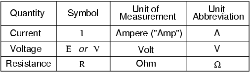

**What is voltage, really?**

> Voltage is what creates the push that makes electrons move. Voltage is the difference between two different points is a cicuit. With only one point voltage means nothing. It's measured in volt (V).

**What is current, really?**

> Current is the rate of electrons. You can think of current as a result of the amount of voltage and resistance in a cicuit.
> Current can only flow when there is a continues path.
> It's measured in ampere (A).

**What is resistance, really?**

> Resistance limits current. Resistance turns electricity into heat.
> Low resistance = good conductor
> High resistance = conductor does not transfer electricity very well.
> Resistance is measured in Ohm (Ω).s

**Why do they depend on eachother.**

> Georg Simon Ohm discovered in 1827 the relationship between volt, current and resistance.
> Current moves throuh a circuit with some degree of friction. Resistance is that friction, and voltage affect the amount of current that can flow.
> If you increase the voltage you get more current. If you increase the resistance you get less current.

---

Ohms law:

```c
U = I*R
I = U/R
R = U/I
```



---

## Experiment setup

### 🧪 Experiment 1: Voltage exists without current

**Setup**

- Power supply or battery
- Multimeter
- No load

**Test**

- Measure current
- Measure voltage

**Questions**

- Will there be voltage?
- Will there be current?

---

### 🧪 Experiment 2: Current depends on resistance

**Setup**

- Fixed voltage (battery or PSU)
- LED
- Different resistors (e.g. 220 Ω, 1 kΩ, 10 kΩ)

**Test**

- Measure current
- Observe brightness

**Questions**

- What changed?
- What stayed the same?
- Did the LED “decide” the current?

---

### 🧪 Experiment 3: Resistance turns energy into heat

- Same voltage
- Low-value resistor (safe power!)
- Measure temperature or touch briefly

**Test**

- Same voltage
- Low-value resistor (safe power!)
- Measure temperature or touch briefly

**Questions**

- Where did the energy go?
- Why did the resistor heat up?

---

## What I thought would happen

---

### 🧪 Experiment 1: Voltage exists without current

- Since there is no load, no current will flow. So 0A.
- Voltage will be what the supply is set to.

Nothing else will happen.

---

### 🧪 Experiment 2: Current depends on resistance

R = (Vin - LEDv) / A

Forward voltage of LED is about 2V.

Vin = 5v

R = 220 Ω, 1 kΩ, 10 kΩ

13mA = 3V / 220 ohm

3mA = 3V / 1k ohm

0,3mA = 3V / 10k ohm

_Measurements_
Current:

- 220 ohm =
- 1k ohm =
- 10k ohm =
  _Brightness_
-

_Questions_

-
- ***

### 🧪 Experiment 3: Resistance turns energy into heat

10 ohm.
It will get really hot. And 100mA will flow.
The energy will turn into heat.
The resistor got hot beacuse...

---

## Theory (minimal)

### ⏸ Pause & Predict

Before continuing, think about this:

> What do you expect will happen if resistance is doubled while voltage stays the same?

---

## What actually happened

### 🧪 Experiment 1: Voltage exists without current

---

### 🧪 Experiment 2: Current depends on resistance

_Measurements_
Current:

- 220 ohm =
- 1k ohm =
- 10k ohm =

## _Brightness_

_Questions_

-
- ***

### 🧪 Experiment 3: Resistance turns energy into heat

_Measurements_
Current:
Temperature:

---

## What surprised me

---

## Rule of thumb

> Voltage pushes, resistance limits, current flows.

---
